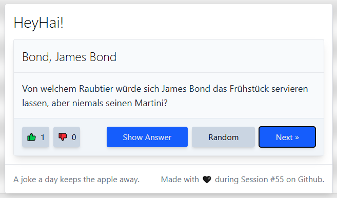

# HeyHai

Vote for the best joke... ;)

## Development

Requires [Node.Js](https://nodejs.org/en/download).
[VS Code](https://code.visualstudio.com) recommended.

Main tools:

* `npm install` - Install prerequisites
* `npm start` - Run dev preview server
* `npm run build` & `npm run preview`

Additional tooling:

* `cleanup.cmd` - Delete all temp. files
* `cleanup.cmd /all` - Delete all temp. files incl. `node_modules`

## Structure

* `.astro`, `node_modules`, `vendor` - temp. files required for development. Remove via `cleanup.cmd`.
* `/public` - source folder will be copied 1:1 to `/dist` during build
* `/src` - Astro static website, holding the UI
* `/dist` - output dir of project build, create with `publish.cmd`

## How this project was created

* `npm create astro@latest`
* `npx astro add tailwind`
* `npx astro add alpinejs`
* AlpineJS `persist` plugin:
  * `npm install @alpinejs/persist`
  * `npm install --save-dev @types/alpinejs__persist`
  * create `src/alpine-entrypoint.ts` and adapt `astro.config.mjs`

## Links

* Icons from https://freesvgicons.com/packs/lsicon
